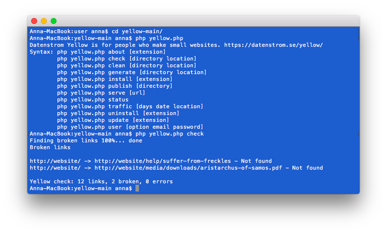

# Check 0.9.6

Find broken links. Developed by Anna Svensson.

## How to install an extension

[Download ZIP file](https://github.com/annaesvensson/yellow-check/archive/refs/heads/main.zip) and copy it into your `system/extensions` folder. [Learn more about extensions](https://github.com/annaesvensson/yellow-update).

## How to find broken links

You can find broken links at the [command line](https://github.com/annaesvensson/yellow-core). It is quite normal for pages to be renamed, files to be removed and some links to no longer work. Open a terminal window. Go to your installation folder, where the file `yellow.php` is. Type `php yellow.php check`, you can optionally add a folder and a location. This will find broken links on your website and show them on screen.

If you don't want that a page is checked, set `Generate: exclude` in the [page settings](https://github.com/annaesvensson/yellow-core#settings-page) at the top of a page.

## How to fix broken links

Once you have found broken links on your website, it’s time to fix them. You have two options. The first option is to replace a broken link. Try to find the new location or the new URL. The second option is to remove a broken link. If it's not possible to find a replacement link then there is nothing left but to remove the obsolete link.

## Examples

Content file with option for generating a static website:

    ---
    Title: Example page
    Generate: exclude
    ---
    This page is not checked for broken links.

Finding broken links at the command line:

`php yellow.php check`  

Finding broken links at the command line, different locations:

`php yellow.php check public /wiki/`  
`php yellow.php check public /blog/`  
`php yellow.php check public /help/how-to-make-a-small-website`  

## Acknowledgements

This extension uses [curl](https://github.com/curl/curl) by Daniel Stenberg. Thank you for the useful library.

Do you have questions? [Get help](https://datenstrom.se/yellow/help/).
